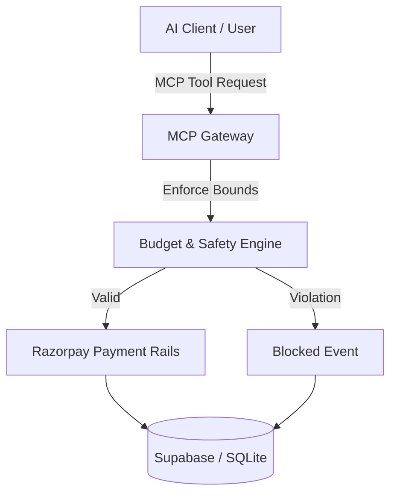

# Architecture Designer Skill

Framework for designing robust distributed systems, microservices, and agentic commerce protocol flows.

## Core Deliverables
1. **Component Topology**: Define boundaries between UI, API bridges, MCP gateways, databases, and payment rails.
2. **Data Flow & Sequence**: Document exact message choreography and state transitions.
3. **Failure Domains**: Identify single points of failure, retry semantics, and circuit breakers.
4. **Mermaid Diagrams**: Visual flowcharts, sequence diagrams, and entity relationship diagrams.

## Standard Flowchart Template

