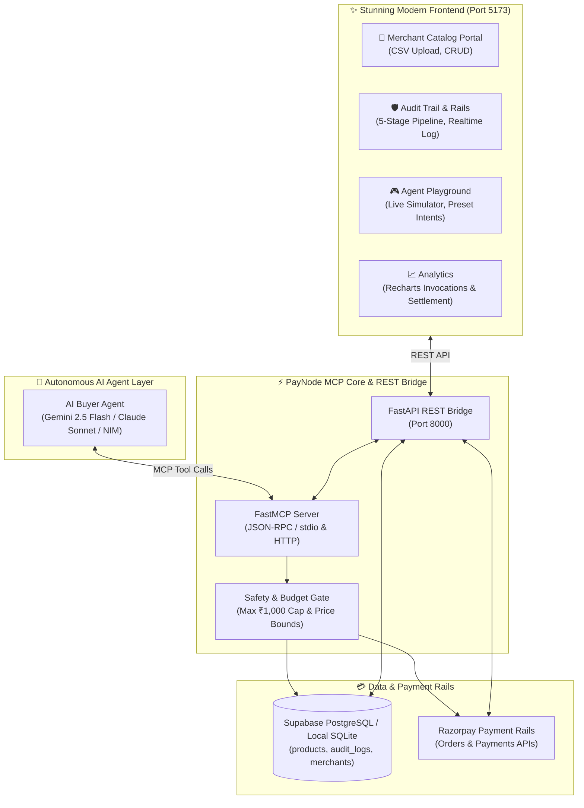

# PayNode: Model Context Protocol (MCP) Gateway for Agentic Commerce

[](https://github.com/jlowin/fastmcp)
[](https://razorpay.com)
[](https://react.dev)
[](https://tailwindcss.com)

> **PayNode** bridges autonomous AI agents with merchant product catalogs and Razorpay payment rails through the Model Context Protocol (MCP). It establishes deterministic safety guardrails, bounded price negotiations, and explainable audit trails for agentic commerce.

---

## 🏛️ System Architecture



---

## 🛠️ MCP Tool Definitions (6 Core Tools)

| Tool Name | Parameters | Return Type | Description |
| :--- | :--- | :--- | :--- |
| `search_products` | `query: str, category?: str, max_price?: int` | `list[dict]` | Search merchant catalog by keyword, category, or maximum price in paise. |
| `get_details` | `product_id: str` | `dict` | Retrieve full technical specifications, inventory stock, and pricing. |
| `negotiate_price` | `product_id: str, offered_price: int` | `dict` | Negotiate discount with merchant-defined floor rules (>=90% accept, 80-89% counter, <80% reject). |
| `create_order` | `product_id: str, quantity: int, agreed_price?: int` | `dict` | Create Razorpay order. **Enforces strict ₹1,000 autonomous purchase ceiling.** |
| `initiate_payment` | `order_id: str, payment_method?: str, simulate_failure?: bool` | `dict` | Authorize and capture payment on Razorpay rails with graceful retry support. |
| `check_status` | `order_id: str` | `dict` | Fetch real-time settlement and order status from Razorpay rails. |

---

## 🛡️ Safety Guardrails & Bounded Rules

1. **Autonomous Purchase Ceiling**:
   - Any order exceeding **₹1,000.00 (100,000 paise)** is strictly blocked by the server guardrail (`blocked_by_guardrail`) and requires explicit human co-signature.
2. **Merchant Discount Floor**:
   - Offers $\ge 90\%$ of listed price: **ACCEPTED**
   - Offers between $80\%$ and $89\%$: **COUNTER-OFFER** (midpoint formula)
   - Offers $< 80\%$: **REJECTED** (prevents predatory agent bargaining)
3. **100% Explainable Audit Trail**:
   - Every tool call logs arguments, results, latency in milliseconds, actor type, and execution status to `audit_logs`.
4. **Graceful Failure & Fallback**:
   - If card payment fails or is declined, agent automatically analyzes error code and retries with secondary rail (UPI: `paynode@upi`).

---

## 🚀 Quickstart Guide

### Prerequisites
- **Python 3.11+**
- **Node.js 18+** & **npm**

### 1. Configure Environment Variables
Create or verify `paynode/.env`:
```env
# Gemini API Key (Optional for LLM Mode)
GEMINI_API_KEY=your_gemini_api_key

# Razorpay Test Credentials (Verified Test Rails)
RAZORPAY_KEY_ID=rzp_test_TT96z4v3ZEgzTL
RAZORPAY_KEY_SECRET=alki5vMUFzomcKqnuQzr2HAN

# Supabase (Optional - SQLite Local Fallback Included)
SUPABASE_URL=https://your-supabase-id.supabase.co
SUPABASE_KEY=your_supabase_anon_key
```

### 2. Seed Database
```bash
python database/seed_data.py
```

### 3. Run Automated Tests
```bash
python -m pytest tests/test_mcp_tools.py -v
```

### 4. Start FastMCP / REST Bridge Server (Port 8000)
```bash
python mcp_server/api_bridge.py
```

### 5. Launch React + Vite Frontend (Port 5173)
```bash
cd frontend
npm run dev
```

---

## 🎙️ 5-Minute Demo Pitch Script

### Hook (0:00 - 0:45)
> "In 2026, AI agents don't just answer questions—they take action. But when an AI agent needs to buy software, hardware, or compute on behalf of a human, traditional checkout forms break down. There is no human clicking 'Submit'.
> 
> Welcome to **PayNode**—the Model Context Protocol (MCP) gateway that turns Razorpay's payment rails into native primitives for autonomous AI buyers."

### The Problem & Protocol Race (0:45 - 1:30)
> "The race for x402, Universal Agentic Payments (UAP), and Agentic Commerce Protocols (ACP) requires three things:
> 1. Real-time catalog discovery via structured MCP tools.
> 2. Hard deterministic safety bounds—never allowing an AI to drain a wallet.
> 3. Immutably explainable audit logs for every single paisa moved."

### Live Demonstration (1:30 - 3:45)
> "Let's see PayNode in action across three scenarios:
> 
> **Scenario 1: Autonomous Discovery & Purchase**
> We give the agent a natural language intent: *'Find a silent wireless mouse under ₹1000 and buy it'*. 
> In 1.2 seconds, the agent invokes `search_products`, inspects the Logitech M330, checks stock, creates a Razorpay order `order_TT9...`, captures payment, and logs the full cryptographic receipt.
> 
> **Scenario 2: Dynamic Bounded Negotiation**
> We ask the agent to negotiate for an Anker USB-C Hub listed at ₹899. The agent invokes `negotiate_price` offering ₹764. The merchant rules counter at ₹831.57, saving money while respecting the merchant's 80% discount floor.
> 
> **Scenario 3: Guardrail Defense**
> An intent attempts to buy a ₹4,499 Keychron Mechanical Keyboard. The PayNode safety gate immediately intercepts the transaction: *'GuardrailViolation: Purchase ceiling of ₹1,000 exceeded'*. The human is protected."

### Merchant & Audit Power (3:45 - 4:30)
> "Merchants can drop a CSV catalog and instantly expose inventory to millions of AI agents. Simultaneously, compliance officers have a real-time Audit Trail with 100% visibility into JSON payloads, latency, and success metrics."

### Conclusion (4:30 - 5:00)
> "PayNode is the missing financial infrastructure for the agentic era. Bounded, explainable, and lightning fast. Thank you!"
